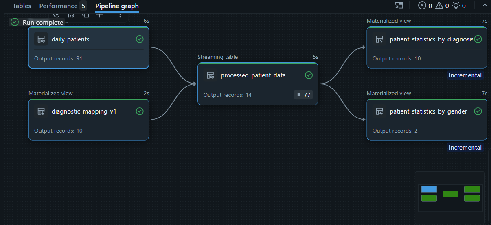

# 🏥 Healthcare Data Pipeline using Databricks Lakeflow

A production-style Healthcare Data Engineering project built using **Databricks Lakeflow Declarative Pipelines**, **Delta Lake**, and the **Medallion Architecture**.

The pipeline incrementally processes healthcare data, applies data quality validations, and generates analytical datasets for reporting.

---

## 🚀 Tech Stack

- Databricks
- Lakeflow Declarative Pipelines (DLT)
- PySpark
- Databricks SQL
- Delta Lake
- Unity Catalog
- Databricks Volumes
- Git & GitHub

---

## 🏗️ Architecture

```
CSV Files
     │
     ▼
Databricks Volumes
     │
     ▼
Raw Delta Tables
     │
     ▼
Bronze Layer
     │
     ▼
Silver Layer
     │
     ▼
Gold Layer
```

---

## 🔄 Pipeline Workflow

| Layer | Description |
|--------|-------------|
| Raw | Ingests healthcare CSV files into Delta tables |
| Bronze | Creates Streaming Tables and Materialized Views |
| Silver | Joins patient and diagnosis data with data quality checks |
| Gold | Creates aggregated patient statistics for reporting |

---

## ✨ Key Features

- Incremental data processing
- Streaming Tables
- Materialized Views
- Medallion Architecture
- Data Quality Expectations
- Delta Lake
- Healthcare analytics

---

## 📊 Pipeline Execution



---

## 📂 Project Structure

```
healthcare-lakeflow-pipeline
│
├── notebooks
│   ├── 01_ingest_raw_data.py
│   └── 02_healthcare_lakeflow_pipeline.sql
│
├── screenshots
│   └── pipeline_graph.png
│
└── README.md
```

---

## 🎯 Skills Demonstrated

- ETL Pipeline Design
- Databricks Lakeflow
- Delta Lake
- PySpark
- SQL
- Incremental Processing
- Data Quality Validation
- Medallion Architecture

---

## 🚀 Future Enhancements

- Auto Loader for file ingestion
- Workflow scheduling
- Power BI dashboard integration
- Parameterized pipeline configuration
